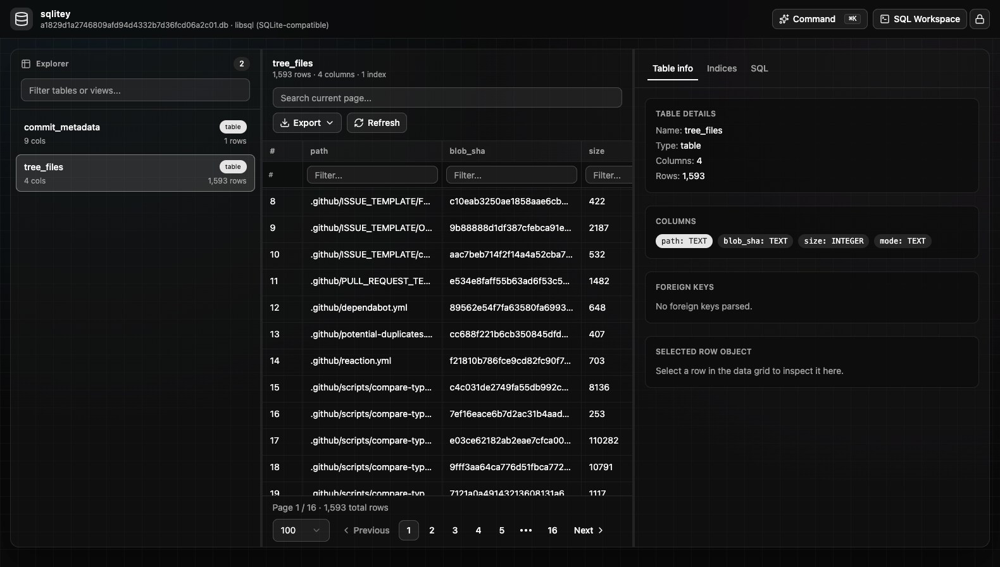

# sqlitey

A simple (vibe coded) SQLite (including [Turso support](https://docs.turso.tech/introduction)) browser.

- View & query table data
- Paginated data grid with virtualization
- Inspect table metadata (indicies, DDL/FKs etc)
- Export data in JSON or CSV
- SQL workspace with keyword autocomplete

## Usage

Install the binary with curl:

```bash
curl -fsSL https://raw.githubusercontent.com/ehesp/sqlitey/main/install.sh | bash
```

```bash
sqlitey path/to/file.db
```

You'll be provided a URL to go to, enjoy!

**Standalone** (`bun run compile:local` or `scripts/release.ts`): ship **`sqlitey-<os>-<arch>`** together with **`turso-<os>-<arch>.node`** in the same directory (also uploaded by CI). Legacy filename `turso.node` beside the binary still works. The N-API addon cannot live inside the single-file Bun executable.



## Another...?!

Yep. This was mainly built without looking at the code for a fun experiment in Cursor design mode. I wanted a very simple, no drama browser which just works. It uses Bun + React (Shadcn) compiled into a binary for easy distribution and minimal effort. It uses [`@tursodatabase/database`](https://www.npmjs.com/package/@tursodatabase/database) (Turso’s embedded engine) for local files and Turso-compatible databases.
